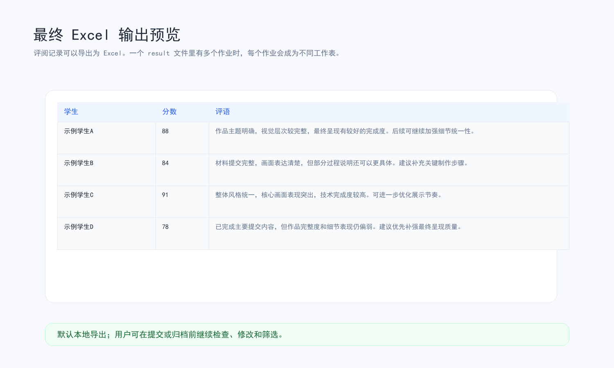
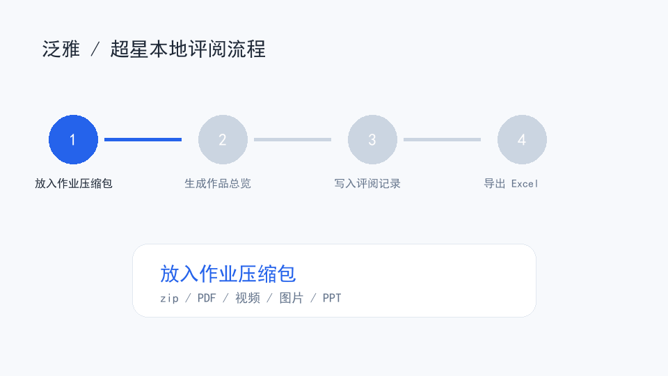

# Demo 流程示例

这个页面用于向第一次了解项目的人展示：一次安全、脱敏的泛雅 / 超星作业辅助评阅大概会发生什么。

示例里的学生、课程、作业、分数和评语都应该使用虚构数据。不要把真实学生姓名、学号、班级、学校、账号截图或课程截图放进公开仓库。

## 适合展示的场景

最适合做 demo 的是视觉类或混合作业，例如：

- 图片、视频、PDF、PPT、报告混合提交的设计类作业；
- 视频作品、动画作品、三维作品、数字媒体作品；
- 每个学生都有一个文件夹或一个压缩包，里面包含最终作品和说明材料；
- 需要最后导出 Excel，供老师检查、修改或归档。

纯文字作业也可以使用本工具，但 demo 重点应改成“整理文档文本、生成评语和导出 Excel”，不要强行宣传作品总览图。

## Demo 输入

推荐准备一个虚构的压缩包，放到：

```text
tmp/bundle/
```

示例结构：

```text
demo-course-assignment.zip
├─ 20240001_示例学生A/
│  ├─ final-video.mp4
│  ├─ layout-board.jpg
│  └─ report.pdf
├─ 20240002_示例学生B/
│  ├─ poster.png
│  ├─ process.pptx
│  └─ source.zip
└─ local-001_示例学生C/
   ├─ render-01.jpg
   └─ reflection.docx
```

真实使用时，工具会根据压缩包或网页名单生成真实 student index。公开 demo 不应使用真实 student index。

## Demo 图片素材

这些图片由虚构数据生成，可以用于 README、项目介绍或试用说明。

### 整体流程


### Before / After


### 作品总览图示例


### Excel 输出预览



### 安全边界


### 短 GIF



## Demo 流程

1. 用户输入：

   ```text
   开始泛雅评阅
   ```

2. 选择“压缩包批阅模式”。

3. 确认或生成评分标准文件。

   评分标准会根据作业说明和用户偏好生成，必须由用户确认后才能评阅学生。

4. 创建或选择评阅记录文件。

   评阅记录会保存在 `result/`，后续继续评阅、导出 Excel 都依赖它。

5. 导入压缩包，生成真实学生名单。

   工具会把学生文件夹标准化，并把导入时状态写入临时 student index。这个状态不是最终评阅进度。

6. 用户确认是否同步网页上已经完成的学生状态。

   如果是压缩包批阅模式，也可以选择不访问网页，直接本地评阅。

7. 用户确认是否有不评阅的学生。

   被跳过的学生会写入评阅记录为 `skipped`，不会混入已评阅学生。

8. 准备 evidence。

   工具会按作业类型处理材料，例如：

   - 视频：抽取关键帧；
   - PDF：渲染前几页；
   - 图片：直接作为可查看材料；
   - docx / pptx：提取可读文本和媒体；
   - 压缩包：解压后继续识别里面的文件。

9. 生成作品总览图或重点文本。

   视觉类、视频类和混合作业通常会先生成 contact sheet。纯文字作业更适合优先查看 `review-text.md`。

10. 写入草稿评阅。

    快速批阅不会直接成为最终结果。第一轮会写入 `draftReviews`，用于检查分数分布、评语质量和异常学生。

11. 用户确认后转为正式评阅。

    工具会先 dry-run，显示将转正多少条、是否有空分数或内部流程话术。用户确认后，草稿才会变成正式 `reviews`。

12. 导出 Excel。

    最终 Excel 默认放在：

    ```text
    outputs/
    ```

## Demo 输出

一次公开 demo 可以展示这些脱敏输出：

- 作品总览图 PNG；
- 一小段虚构的评阅记录截图；
- Excel 表格预览；
- 评分标准摘要；
- “不会提交网页成绩”的安全边界说明。

不要公开展示：

- 真实学生姓名或学号；
- 真实班级、课程、学校；
- 浏览器登录状态；
- 泛雅 / 超星页面中的真实作业列表；
- 含有学生作品版权风险的原图或视频。

## 推荐对外描述

可以这样介绍：

> 这是一个面向高校视觉类、设计类、影视 / 动画 / 数字媒体课程的本地作业评阅辅助工具。它可以整理泛雅 / 超星导出的学生作业压缩包，生成作品总览、建议分数、学生可读评语和 Excel 表格。工具不会在网页上提交成绩，最终判断由老师确认。

不建议这样介绍：

> 自动批改所有作业、自动给学生打分、自动提交成绩。

这些说法不符合项目设计，也容易造成误解。
